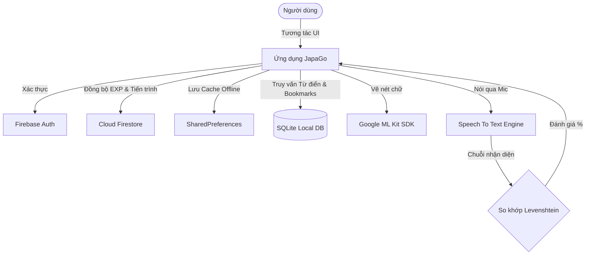

# 🇯🇵 JapaGo — Ứng Dụng Học Tiếng Nhật Game Hóa (Gamification)

<p align="center">
  
</p>

<p align="center">
  
  
  
  
</p>

---

## 📖 1. Giới thiệu ứng dụng

**JapaGo** (hay còn gọi là *Kanji Summoner* trong dự án phát triển) là một ứng dụng di động hỗ trợ tự học tiếng Nhật từ con số 0 (bảng chữ cái Hiragana/Katakana) đến trình độ sơ cấp N5. 

Khác biệt với các ứng dụng học tập truyền thống, JapaGo áp dụng phương pháp **Gamification (Game hóa)** vào lộ trình học tập nhằm tối ưu hóa động lực và trải nghiệm học tập của người dùng. Các bài học được thiết kế như những chặng thám hiểm, việc tích lũy từ vựng hay Kanji giống như việc "triệu hồi và thu phục thú cưng", giúp việc tiếp thu kiến thức trở nên tự nhiên, thú vị và không hề nhàm chán.

---

## ✨ 2. Các chức năng nổi bật

### 🗺️ Lộ trình học tập (Roadmap)
- Thiết kế sơ đồ bài học dạng cây (như Duolingo), chia làm các chặng chủ đề rõ ràng (Chào hỏi, Gia đình, Quốc gia, Tính từ, v.v.).
- Khóa bài học tiếp theo nếu chưa hoàn thành các bài học trước đó.

### 🔠 Bảng chữ cái tương tác
- Học cách viết các chữ Hiragana và Katakana thông qua các video/hình ảnh minh họa trực quan.
- Cho phép người dùng luyện viết trực tiếp trên màn hình và tự động nhận diện chữ nét viết.

### ✍️ Nhận diện chữ viết tay AI (Google ML Kit)
- Tích hợp công nghệ **Google ML Kit Digital Ink Recognition** để phân tích nét vẽ thực tế của người dùng trên Canvas.
- Trả về kết quả khớp và chấm điểm độ chính xác khi viết Kanji và chữ cái.

### 🗣️ Luyện phát âm & Giao tiếp (Whisper API / Speech-To-Text)
- Hỗ trợ người dùng luyện nói tiếng Nhật bằng việc thu âm giọng đọc trực tiếp.
- Sử dụng thuật toán **Levenshtein Distance** để so sánh độ tương đồng giữa văn bản được nhận diện từ giọng nói với câu mẫu tiếng Nhật, đưa ra điểm số chính xác theo phần trăm (%).

### 🧩 Đa dạng các thể loại bài tập
- **Image Quiz:** Trắc nghiệm kết hợp hình ảnh trực quan sinh động.
- **Listening:** Luyện nghe từ vựng qua công cụ Text-To-Speech (TTS).
- **Flashcards:** Thẻ ghi nhớ thông minh, hiển thị nghĩa, cách đọc Hiragana/Romaji kèm hình ảnh ví dụ.
- **Sentence Builder:** Ghép các thẻ từ để tạo thành một câu hoàn chỉnh đúng ngữ pháp.
- **Matching Game:** Thử thách nối cặp từ vựng Nhật - Việt để ôn tập phản xạ nhanh.

### 🏆 Hệ thống Thăng cấp & Phần thưởng
- **EXP & Ranks:** Tích lũy điểm kinh nghiệm (EXP) thông qua các bài học để nâng cấp danh hiệu (từ *Tân binh* đến *Đại tướng*).
- **Achievements:** Mở khóa các danh hiệu thành tích độc đáo.
- **Leaderboard:** Bảng xếp hạng trực tuyến vinh danh các học viên có điểm EXP cao nhất.

### 📓 Sổ tay từ vựng (Bookmarks)
- Dễ dàng lưu lại các từ vựng khó hoặc cần ôn tập thường xuyên vào sổ tay cá nhân.

---

## 🛠️ 3. Thư viện & Công nghệ sử dụng

Ứng dụng JapaGo được xây dựng trên nền tảng **Flutter SDK (Dart)** phối hợp cùng các thư viện và API mạnh mẽ:

| Thư viện / Công nghệ | Phiên bản | Vai trò & Chức năng |
| :--- | :--- | :--- |
| `flutter` | `^3.10.8` | Framework chính phát triển ứng dụng đa nền tảng |
| `firebase_core` / `firebase_auth` | `^4.9.0` / `^6.5.1` | Quản lý đăng nhập, đăng ký và xác thực người dùng |
| `cloud_firestore` | `^6.4.1` | Cơ sở dữ liệu đám mây đồng bộ tiến trình học tập, bảng xếp hạng |
| `sqflite` / `path` | `^2.4.2` / `^1.9.1` | Cơ sở dữ liệu SQLite cục bộ lưu trữ từ điển, từ vựng, ngữ pháp, sổ tay |
| `google_mlkit_digital_ink_recognition` | `^0.14.2` | AI nhận diện chữ viết tay ngoại tuyến từ các nét vẽ trên màn hình |
| `flutter_tts` | `^4.2.5` | Chuyển đổi văn bản tiếng Nhật thành giọng nói tự động (Text-To-Speech) |
| `speech_to_text` | `7.3.0` | Nhận diện giọng nói của người dùng để phân tích phát âm |
| `shared_preferences` | `^2.2.2` | Cache tiến trình học và cài đặt offline tại thiết bị cục bộ |
| `provider` | `^6.1.5+1` | Quản lý trạng thái (State Management) trong ứng dụng |
| `video_player` | `^2.8.6` | Trình phát video hướng dẫn cách viết từng nét chữ cái |
| `vibration` | `^3.1.6` | Tạo hiệu ứng rung phản hồi (Haptic feedback) khi trả lời đúng/sai |

---

## ⚙️ 4. Cách hoạt động của ứng dụng (Architecture & Workflow)

JapaGo hoạt động theo mô hình tích hợp dữ liệu Cục bộ (Offline-first) kết hợp Đồng bộ hóa Đám mây (Cloud sync):



1. **Khởi tạo dữ liệu:** Khi khởi chạy ứng dụng lần đầu, `DatabaseHelper` sẽ tự động tạo cơ sở dữ liệu SQLite cục bộ (`kanji_summoner.db`) và nạp trước dữ liệu từ vựng sơ cấp N5. Đồng thời, `RecognitionManager` sẽ tải xuống gói dữ liệu ngôn ngữ tiếng Nhật (`ja`) ngoại tuyến phục vụ việc nhận diện chữ viết tay.
2. **Quá trình học tập & Làm bài:** 
   - Với bài tập **Viết (Kanji/Chữ cái)**: Các điểm chạm của người dùng được chuyển đổi thành các tọa độ vector `StrokePoint`. Sau đó, `google_mlkit_digital_ink_recognition` sẽ đối chiếu xem nét vẽ có khớp với chữ cái mục tiêu không.
   - Với bài tập **Phát âm**: Ứng dụng ghi nhận luồng âm thanh thông qua microphone, chuyển hóa thành ký tự văn bản tiếng Nhật thông qua `speech_to_text`. Thuật toán `Levenshtein Distance` so sánh khoảng cách biên tập giữa chuỗi người dùng phát âm với đáp án chuẩn để tính điểm phần trăm trùng khớp.
3. **Quản lý & Đồng bộ tiến trình:**
   - Điểm EXP và các bài học đã vượt qua được lưu trực tiếp vào bộ nhớ máy qua `SharedPreferences`.
   - Nếu người dùng đã đăng nhập tài khoản qua Firebase Auth, tiến trình này sẽ ngay lập tức được đồng bộ lên Cloud Firestore. Nhờ đó, người dùng có thể đổi thiết bị mà không bị mất tiến trình học.

---

## 🗄️ 5. Cấu trúc Cơ sở dữ liệu (Database Schema)

### A. SQLite Database (Local)
Cơ sở dữ liệu offline gồm 4 bảng chính được định nghĩa tại [database_helper.dart](file:///c:/Github/SE346_AppProject/lib/database_helper.dart):

#### Bảng `kanji` (Lưu thông tin Kanji học tập)
- `id` (INTEGER, PRIMARY KEY AUTOINCREMENT)
- `character` (TEXT): Chữ Kanji (Ví dụ: '火')
- `meaning` (TEXT): Nghĩa của chữ (Ví dụ: 'Lửa (Fire)')
- `strokes` (TEXT): Số nét viết

#### Bảng `vocabulary` (Từ vựng N5 học tập)
- `id` (INTEGER, PRIMARY KEY AUTOINCREMENT)
- `word` (TEXT): Từ viết bằng Kanji hoặc Kana (Ví dụ: '猫')
- `reading` (TEXT): Phiên âm Romaji/Hiragana (Ví dụ: 'Neko')
- `meaning` (TEXT): Ý nghĩa tiếng Việt
- `level` (TEXT): Trình độ (Mặc định: 'N5')
- `is_mastered` (INTEGER): Đánh dấu từ đã thuộc hay chưa (0: Chưa thuộc, 1: Đã thuộc)

#### Bảng `grammar` (Trận pháp - Ngữ pháp)
- `id` (INTEGER, PRIMARY KEY AUTOINCREMENT)
- `structure` (TEXT): Cấu trúc ngữ pháp (Ví dụ: 'N + です')
- `usage` (TEXT): Cách dùng
- `example` (TEXT): Câu ví dụ đi kèm

#### Bảng `bookmarks` (Sổ tay lưu trữ từ vựng của bạn)
- `id` (INTEGER, PRIMARY KEY AUTOINCREMENT)
- `jp_word` (TEXT): Từ tiếng Nhật được lưu
- `romaji` (TEXT): Cách đọc
- `meaning` (TEXT): Ý nghĩa tiếng Việt
- `type` (TEXT): Phân loại (Mặc định: 'vocabulary')

### B. Firebase Firestore (Cloud)
Dữ liệu lưu trữ tập trung tại collection `users`:
```typescript
users / {uid} (Document) {
    name: string,             // Tên hiển thị của học viên
    email: string,            // Địa chỉ email tài khoản
    exp: number,              // Tổng điểm tích lũy học tập
    completedLessons: array,  // Danh sách các ID bài học đã vượt qua (Ví dụ: ['lesson_1', 'lesson_2'])
    lastUpdated: timestamp    // Thời điểm đồng bộ cuối cùng
}
```

---

## 📥 6. Cách tải và cài đặt ứng dụng (Installation Guide)

### 📋 Yêu cầu hệ thống trước khi cài đặt:
- Đã cài đặt **Flutter SDK** (Phiên bản gợi ý `>= 3.10.8`).
- Đã cài đặt **Dart SDK** tương thích.
- **Java JDK 11** hoặc mới hơn.
- Công cụ phát triển: **Android Studio** hoặc **Visual Studio Code** (đã cài extension Flutter & Dart).
- Thiết bị thử nghiệm: Máy ảo Android/iOS hoặc thiết bị thật kết nối qua cổng USB (đã bật chế độ gỡ lỗi nhà phát triển).

### 🚀 Các bước cài đặt dự án:

1. **Tải mã nguồn về máy:**
   ```bash
   git clone https://github.com/thuanhuy2006/SE346_AppProject.git
   cd SE346_AppProject
   ```

2. **Cài đặt các gói phụ thuộc (Dependencies):**
   ```bash
   flutter pub get
   ```

3. **Cấu hình Firebase:**
   - Tạo một dự án mới trên [Firebase Console](https://console.firebase.google.com/).
   - Kích hoạt tính năng **Authentication** (Đăng nhập bằng Email/Password) và **Cloud Firestore**.
   - Đăng ký app Android / iOS với Firebase trong console để tải file cấu hình:
     - Dành cho Android: Tải file `google-services.json` đặt vào thư mục `android/app/`.
     - Dành cho iOS: Tải file `GoogleService-Info.plist` đưa vào thư mục `ios/Runner/` thông qua Xcode.

4. **Chạy ứng dụng:**
   - Kết nối thiết bị hoặc khởi động máy ảo.
   - Chạy lệnh sau trên terminal của thư mục dự án:
     ```bash
     flutter run
     ```

---

## 🎯 7. Hướng dẫn sử dụng (User Guide)

1. **Đăng nhập / Đăng ký:**
   - Khi mở app lần đầu, bạn có thể tạo tài khoản qua email để tiến trình học được lưu trên đám mây, hoặc chọn chế độ **Khách (Guest)** để trải nghiệm nhanh.
2. **Học Bảng chữ cái:**
   - Vào menu Bảng chữ cái để xem danh sách Hiragana/Katakana.
   - Nhấn vào từng chữ để nghe phát âm, xem video hướng dẫn vẽ các nét viết và tập viết trực tiếp.
3. **Thám hiểm Lộ trình (Roadmap):**
   - Bắt đầu với bài học đầu tiên (Chào hỏi cơ bản).
   - Hoàn thành các loại bài tập: trắc nghiệm, viết chữ tay, thu âm giọng nói để trả lời câu hỏi giao tiếp.
   - Trả lời đúng liên tục sẽ giúp bạn hoàn thành bài học và nhận thêm điểm EXP thưởng.
4. **Theo dõi Tiến độ & Thăng hạng:**
   - Kiểm tra Hồ sơ (Profile) để xem cấp bậc hiện tại của bạn (Tân binh -> Đại tướng) cùng các huy hiệu thành tích đã mở khóa.
   - Truy cập **Bảng xếp hạng (Leaderboard)** để so tài điểm EXP cùng với những người học khác trong thời gian thực.
5. **Tra cứu & Lưu trữ sổ tay:**
   - Trong lúc học, nhấn vào biểu tượng ngôi sao bên cạnh từ vựng để lưu vào **Sổ tay từ vựng**.
   - Mở Sổ tay để xem lại danh sách từ vựng đã chọn giúp tăng khả năng ghi nhớ dài hạn.
